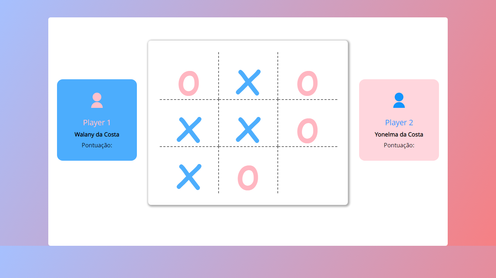

<h1 style='text-align: center; font-size:4rem;'>
    <span style='color: #1294fd;'>Tic-</span><span style='color: white'>Tac</span><span style='color: pink'>-Toe</span>
</h1> 



## Descrisão
>Este mini-projeto foi desenvolvido como um aquecimento para este ano que a está só a começar.

<h4 align="center"> 
	🚧  O tic-tac-toe 🚀 Em construção...  🚧
</h4>

## Tabela de sumários

<!--ts-->
   * [Descrisão](#descrisão)
   * [Tabela de Conteudo](#tabela-de-conteudo)
   * [Instalação](#instalacao)
   * [Pré-requisitos para usar o project](#Pré-requisitos)
   * [Tecnologias](#tecnologias)
   * [Autor](#Autor)
<!--te-->


## Pré-requisitos
---

> Antes de começar, você vai precisar ter instalado em sua máquina a seguinte ferramenta que é o 
> [Git](https://git-scm.com). Além disto é bom ter um editor para trabalhar com o código como [VSCode](https://code.visualstudio.com/)

```bash
# Clone este repositório
$ git clone <https://github.com/tgmarinho/nlw1>

# Acesse a pasta do projeto no terminal/cmd
$ cd tic-tac-toe

# Instale as dependências
$ npm install

# Execute a aplicação em modo de desenvolvimento
$ npm start

# O servidor inciará na porta:3333 - acesse <http://localhost:3333>
```

## 🛠 Tecnologias
---

> As seguintes ferramentas foram usadas na construção do projeto:

- [React](https://pt-br.reactjs.org/)
- [VSCode](https://code.visualstudio.com/)
- [Git](https://git-scm.com)
- [react-icon](https://react-icons.github.io/react-icons/)

## Autor
---
<span style='text-align: center;'> Desenvolvido por Walany da Costa com muito carinho 💖 esse mini-project.</span>